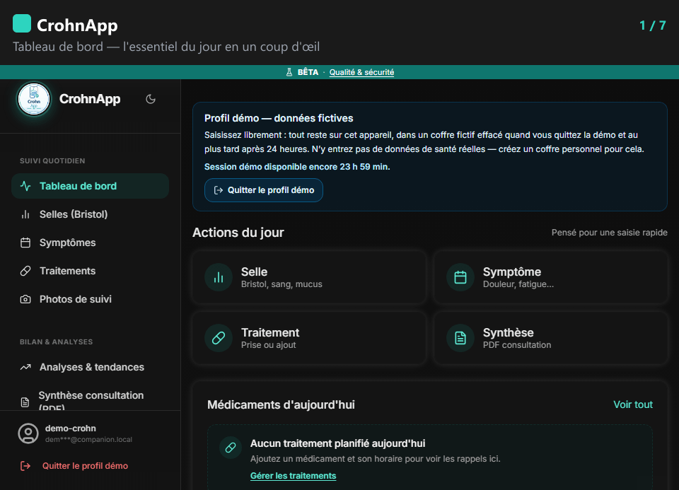
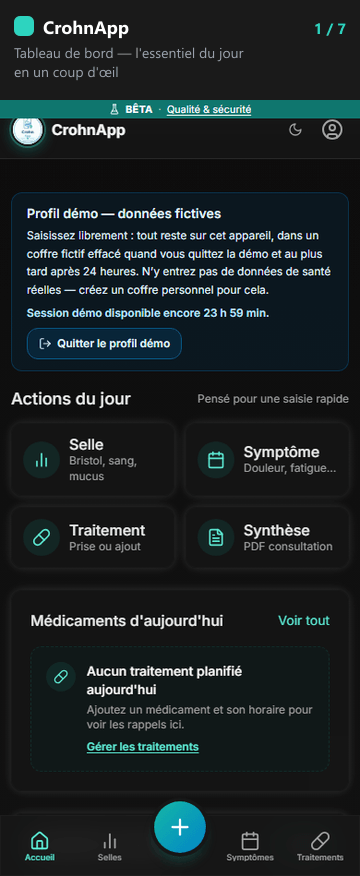

# CrohnApp — Documentation publique

**Application en ligne : [https://crohnapp.com](https://crohnapp.com)**

> **Statut : bêta publique local-first.** CrohnApp est actuellement présenté comme un carnet personnel descriptif. Sa qualification réglementaire fait l'objet d'un cadrage spécifique.

## Tutoriel — comment ça marche

Captures réelles de l'application, réalisées sur un profil fictif (données fictives) : tableau de bord, selles (Bristol), symptômes, traitements, analyses, synthèse PDF et exports/sauvegardes chiffrées. Depuis la v1.2.7, ce profil fictif n'est plus proposé sur le site : pour utiliser CrohnApp, créez votre carnet depuis [crohnapp.com](https://crohnapp.com).

## Guides mobiles essentiels

- [Questions fréquentes — mises à jour, sauvegardes, analyses et données](docs/FAQ.md)
- [Mettre à jour CrohnApp et vérifier la version](docs/guides/mise-a-jour-pwa.md)
- [Créer et restaurer une sauvegarde chiffrée](docs/guides/sauvegarder-restaurer.md)
- [Exporter un graphique d'analyse en PNG](docs/guides/exporter-analyses-png.md)

Ces guides utilisent uniquement des données fictives. Ils sont capturés sur un profil fictif, à
l'exception de la restauration d'une sauvegarde, qui demande un carnet personnel. Une procédure
écrite reste présente sous chaque GIF pour l'accessibilité et pour les connexions lentes.

Ce dépôt contient uniquement la **documentation** de CrohnApp, une PWA React/TypeScript qui aide une personne vivant avec la maladie de Crohn à suivre ses symptômes, selles, traitements et à préparer une discussion avec son équipe soignante.

Le **code source vit dans un dépôt privé**. Ce dépôt public existe pour donner une transparence vérifiable sur la finalité, les données traitées, l'architecture de confidentialité et les limites du produit, sans exposer l'ensemble du code applicatif. Un accès en lecture au code source peut être accordé sur demande motivée (contact ci-dessous).

## Ce que fait l'application (résumé)

- Journal quotidien : selles (échelle de Bristol), symptômes, traitements, photos optionnelles.
- Suivi des prises déclarées et oublis explicitement déclarés — jamais déduits d'une absence de saisie.
- Graphiques et comptes des données saisies : fréquence, intensité, prises renseignées.
- Synthèse des données déclarées pour la consultation, exportable en PDF.
- Rappels locaux (traitement, rendez-vous, résumé) affichés tant que l'application est ouverte ou active sur l'appareil. Le déclenchement application complètement fermée n'est pas garanti : l'export agenda `.ics` reste le moyen fiable d'être averti hors application.
- Aucune donnée de santé ne quitte l'appareil sans action explicite de l'utilisateur (export CSV/JSON/PDF).

Elle ne diagnostique pas, ne remplace pas un professionnel de santé et ne doit pas être utilisée pour trier une urgence.

Depuis la v1.2.6, le calcul du score HBI et le « signal de suivi » sont suspendus, dans l'attente d'une relecture médicale et réglementaire. Les scores déjà enregistrés sont conservés. Voir [compliance/hbi_calcul.md](compliance/hbi_calcul.md).

## Appel à participation (bêta publique)

Le projet cherche des retours pour progresser, de deux profils en particulier :

- **Patients et aidants** : testez le parcours réel (saisie, planning de traitements, synthèse PDF) et signalez ce qui est confus, incorrect ou manquant.
- **Professionnels de santé** : une relecture du contenu clinique (échelle de Bristol, libellés, calcul du HBI aujourd'hui suspendu) par un médecin ou un(e) soignant(e) serait précieuse avant tout usage élargi — voir [compliance/plan_validation_clinique.md](compliance/plan_validation_clinique.md) et [compliance/sources_cliniques.md](compliance/sources_cliniques.md) pour l'état actuel des sources.

CrohnApp est actuellement présenté comme un carnet personnel descriptif. Sa qualification réglementaire fait l'objet d'un cadrage spécifique. CrohnApp n'est pas destiné à poser un diagnostic ni à recommander un traitement, et ne remplace pas un avis médical. Pour participer ou remonter un retour : [crohnapp@gmail.com](mailto:crohnapp@gmail.com).

## Dossier conformité

Rédigé pour être lisible par un non-technicien, il reflète l'architecture réelle de l'application :

| Fichier | Objet |
|---|---|
| [compliance/finalite_application.md](compliance/finalite_application.md) | Ce que fait l'application et ce qu'elle ne fait pas |
| [compliance/donnees_collectees.md](compliance/donnees_collectees.md) | Inventaire des données traitées et de leur stockage |
| [compliance/registre_traitements_rgpd.md](compliance/registre_traitements_rgpd.md) | Analyse RGPD adaptée au mode local |
| [compliance/politique_suppression_donnees.md](compliance/politique_suppression_donnees.md) | Comment supprimer / exporter ses données |
| [compliance/analyse_risque_securite.md](compliance/analyse_risque_securite.md) | Risques identifiés et mesures de réduction |
| [compliance/sources_cliniques.md](compliance/sources_cliniques.md) | Références des scores et échelles utilisés |
| [compliance/limites_dispositif_medical.md](compliance/limites_dispositif_medical.md) | Statut réglementaire et frontières à ne pas franchir |
| [compliance/preuves_ia_exigences.md](compliance/preuves_ia_exigences.md) | État des preuves, IA et exigences avant toute évolution |
| [compliance/hbi_calcul.md](compliance/hbi_calcul.md) | Calcul HBI : statut (suspendu), formule, source et seuils |
| [compliance/flux_donnees.md](compliance/flux_donnees.md) | Vérification documentée des flux de données (« local-first ») |
| [compliance/plan_validation_clinique.md](compliance/plan_validation_clinique.md) | Plan de validation terrain (beta) |
| [compliance/journal_changements.md](compliance/journal_changements.md) | Journal des évolutions notables |

## Autre documentation

- [docs/revue-technique-flux-donnees.md](docs/revue-technique-flux-donnees.md) — revue technique **interne** des flux de données : ce qui a été cherché, ce qui a été constaté, et ce que cette revue ne prouve pas. Un audit de sécurité externe indépendant reste à réaliser.
- [docs/EXPORT_SECURITY.md](docs/EXPORT_SECURITY.md) — sauvegardes chiffrées et limites de récupération.
- [docs/international-rollout.md](docs/international-rollout.md) — porte de revue avant tout nouveau pays.
- **Vérification du code source** — le code reste privé. Une lecture des modules qui portent le chiffrement, le stockage local et les exports peut être accordée sur demande motivée : [crohnapp@gmail.com](mailto:crohnapp@gmail.com).

## Fonctionnement local et confidentialité

- Aucun compte serveur requis. L'e-mail est un identifiant local sur l'appareil, jamais synchronisé.
- Le mot de passe déverrouille un coffre local chiffré (AES-GCM-256, clé dérivée par PBKDF2-SHA-256). Après un rechargement, un profil réel se reverrouille : le mot de passe n'est jamais stocké.
- Les photos, leurs miniatures et les informations qui les accompagnent sont chiffrées dans un espace séparé. Une sauvegarde des photos et une sauvegarde du carnet sont deux fichiers distincts.
- **Mesure d'audience limitée aux pages publiques.** Sur le site de production `crohnapp.com`, Vercel Web Analytics compte les pages vues de l'accueil (`/`), de la connexion (`/auth`) et des pages d'information : aide, confidentialité, mentions légales, conditions d'utilisation, accessibilité, qualité et sécurité. Il s'agit de statistiques agrégées, sans cookie selon la documentation de Vercel. Les pages du carnet ne sont jamais mesurées, et aucune donnée de santé n'est transmise. Les signaux « Do Not Track » et « Global Privacy Control » du navigateur désactivent la mesure. Détail dans la [politique de confidentialité](https://crohnapp.com/privacy).
- **Référencement Google.** Les pages publiques sont déclarées à Google Search (Google Search Console) pour apparaître dans les résultats de recherche. L'application ne charge aucun script Google.
- Aucun traceur ni cookie publicitaire.

## Périmètre médical et réglementaire

CrohnApp est une **bêta publique**, ouverte à l'essai et aux retours d'usage. Toute expérimentation structurée avec des patients ou des professionnels de santé est conduite séparément, sous forme de pilote encadré défini dans [compliance/plan_validation_clinique.md](compliance/plan_validation_clinique.md).

CrohnApp ne revendique aujourd'hui aucune certification médicale, qualification réglementaire, certification d'hébergeur de données de santé, ni validation institutionnelle. Sa qualification réglementaire fait l'objet d'un cadrage spécifique. Ce n'est ni un service d'urgence, ni un outil de diagnostic. Ces exigences seront réévaluées si l'architecture ou la destination d'usage évoluent.

## Hors périmètre actuel

Volontairement absents de cette version : publication sur un store applicatif (Google Play/App Store), synchronisation cloud, publicité et tout traceur commercial. Ce sont des directions possibles pour une phase ultérieure, chacune conditionnée à une revue légale, clinique et de sécurité dédiée.

## Contact

Pour toute question, retour de participation ou demande d'accès en lecture au code source : [crohnapp@gmail.com](mailto:crohnapp@gmail.com)

---

## English summary

> **Status: public local-first beta.** CrohnApp is currently presented as a descriptive personal logbook. Its regulatory qualification is being specifically assessed.

This repository contains only the **documentation** for CrohnApp, a React/TypeScript PWA that helps people living with Crohn's disease track symptoms, stool logs and medication, and prepare better conversations with their care team.

The **source code lives in a private repository**. This public repository exists to provide verifiable transparency on the product's purpose, data handling, privacy architecture and boundaries, without exposing the full application code. Read access to the source can be granted on request (contact below).

It does not diagnose, replace a clinician, or triage emergencies.

Since v1.2.6, the HBI score calculation and the "follow-up signal" are suspended, pending medical and regulatory review. Scores already recorded are kept.

## Call for participation (open beta)

The project is looking for feedback from two groups in particular:

- **Patients and caregivers**: try the real journey (logging, medication schedule, PDF summary) and report anything confusing, incorrect or missing.
- **Healthcare professionals**: a review of the clinical content (Bristol scale, wording, and the HBI calculation, currently suspended) by a clinician would be valuable before any wider use — see [compliance/plan_validation_clinique.md](compliance/plan_validation_clinique.md) and [compliance/sources_cliniques.md](compliance/sources_cliniques.md) for the current state of sources.

CrohnApp is not intended to diagnose or to recommend a treatment, and does not replace medical advice.

## Contact

For questions, feedback, or a source-code read-access request: [crohnapp@gmail.com](mailto:crohnapp@gmail.com)
