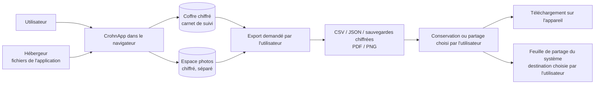

# Où vont les données (« local-first »)

*Revérifié le 30 août 2026 sur CrohnApp v1.2.4. À refaire avant toute version qui ajouterait un
échange avec un serveur.*

La formulation publique autorisée est : « Les données sont enregistrées localement par défaut.
L'utilisateur peut les consulter, les modifier, les exporter et les supprimer. » Les formulations
absolues — « 100 % privé », « zéro risque », « conformité garantie » — restent interdites.

## État vérifié

| Sujet | Constat en v1.2.4 |
| --- | --- |
| Carnet de suivi | Enregistré dans un coffre chiffré sur l'appareil, ouvert par le mot de passe du profil. |
| Photos | Enregistrées chiffrées dans un espace séparé, jamais téléversées. |
| Compte | Aucun serveur d'identité. Le profil et son mot de passe sont locaux ; pas de « mot de passe oublié » à distance. |
| Base distante | Aucune. Aucune synchronisation entre appareils. |
| Appels réseau sortants | Aucun dans le code de l'application : ni requête de fond, ni envoi automatique, ni connexion permanente. |
| Sauvegardes | Deux sauvegardes distinctes, carnet et photos, créées et restaurées manuellement. Aucune sauvegarde automatique dans le cloud. |
| PDF et PNG | Produits sur l'appareil. L'application ne les envoie nulle part. Depuis la v1.2.2, la synthèse peut être remise à une autre application par la feuille de partage du système, sur demande explicite : voir ci-dessous. |
| Mesure d'audience et rapports d'erreur | Aucun outil tiers. La page « Analyses » calcule tout sur l'appareil. |
| Mon espace santé | L'application prépare le PDF et ouvre le site officiel dans un nouvel onglet. Elle n'y dépose rien : le versement est fait par l'utilisateur, sur ce site, hors de CrohnApp. |
| Ancienne adresse de la bêta | Une passerelle ne redirige vers l'adresse actuelle que si aucun carnet local n'existe sur l'ancienne. Sinon elle avertit, sans rien transférer : voir ci-dessous. |
| Liens externes | Navigation volontaire vers des pages publiques ou ouverture du logiciel de messagerie. Aucune donnée du carnet n'est placée dans ces liens. |

## Partage de la synthèse

Depuis la v1.2.2, un bouton permet de remettre la synthèse PDF à une autre application du
téléphone. C'est une sortie volontaire, jamais automatique, et aucun serveur de CrohnApp
n'intervient : le fichier passe du navigateur au système, puis à l'application que vous
désignez. Le résumé textuel qui accompagne le fichier porte sur les mêmes données déclarées.

Une fois la remise faite, le fichier suit les règles de l'application destinataire. Le partage
n'est pas proposé depuis le profil de démonstration. Le détail figure dans
[Sauvegardes et exports](../docs/EXPORT_SECURITY.md).

## Ancienne adresse de la bêta

Un coffre local appartient à l'adresse web sur laquelle il a été créé : le navigateur interdit
tout partage entre deux domaines, et les données sont chiffrées par un mot de passe que
l'application ne connaît pas. Aucune migration automatique n'est donc possible, ni souhaitable.

La passerelle ne redirige que lorsqu'aucune trace de carnet n'est trouvée sur l'ancienne adresse.
Dans tous les autres cas — carnet présent, lecture impossible, délai dépassé — elle avertit et
laisse la personne exporter elle-même avant de basculer. Le doute ne déclenche jamais de
redirection.

## Hébergement

L'application est servie sous forme de fichiers statiques. Comme tout hébergeur, le prestataire
voit les requêtes de chargement, notamment l'adresse IP et le type de navigateur. Le contenu du
carnet ne figure pas dans ces requêtes.

## Ce qui rendrait cette vérification caduque

L'ajout d'un compte serveur, d'une base distante, d'une synchronisation, d'une sauvegarde dans le
cloud, d'une mesure d'audience, d'un rapport d'erreur automatique, d'un envoi d'e-mail intégré, ou
de tout échange transportant des données utilisateur.

## Aller plus loin

Ce document décrit le comportement observable, pas l'implémentation. Pour une question technique
précise ou une demande de lecture du code : [crohnapp@gmail.com](mailto:crohnapp@gmail.com).
