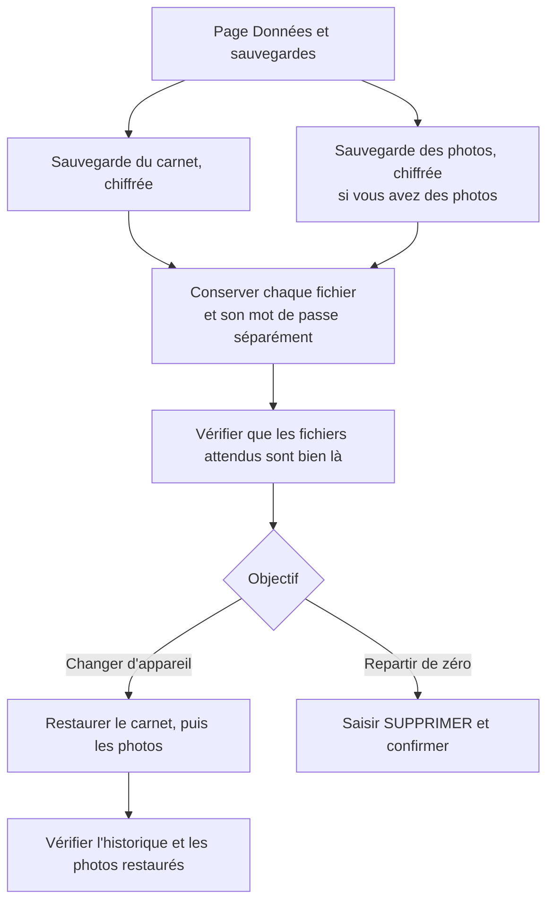

# Sauvegarder, exporter et supprimer ses données

*Revérifié le 30 août 2026 sur CrohnApp v1.2.4.*

## Sauvegarder avant toute opération destructive

Les mots de passe du profil et des sauvegardes ne peuvent pas être récupérés. Une sauvegarde des
photos ne remplace pas celle du carnet, et inversement.

## Ce que vous pouvez exporter

1. **CSV et JSON lisibles** : utiles pour réutiliser vos données ailleurs, mais lisibles par
   quiconque obtient le fichier.
2. **Sauvegarde du carnet, chiffrée** : profil, selles, symptômes, traitements, rendez-vous et
   scores.
3. **Sauvegarde des photos, chiffrée** : fichier distinct, qui peut être volumineux.
4. **Synthèse PDF et graphiques PNG** : documents lisibles, destinés à être montrés ou partagés.

## Supprimer ses données

- Chaque entrée — selle, symptôme, traitement, photo, rendez-vous — peut être supprimée
  individuellement depuis son écran.
- La remise à zéro complète se trouve dans **Données et sauvegardes** et demande de saisir le mot
  `SUPPRIMER`. Elle efface le profil, le carnet, les historiques et les photos de cet appareil.
- L'opération est immédiate et irréversible. Comme rien n'est conservé sur un serveur, il n'existe
  aucune copie à restaurer.

## Le cas du profil de démonstration

La démonstration ne suit pas ces règles, parce qu'elle ne contient pas vos données :

- Son contenu vit dans un coffre fictif séparé, ouvert par un mot de passe constant inscrit dans
  l'application. Il ne protège rien et n'a pas vocation à recevoir de données réelles.
- Il est effacé automatiquement à la sortie de la démonstration, à l'échéance des 24 heures, ou au
  premier chargement suivant. Aucune action de votre part n'est nécessaire.
- La restauration d'une sauvegarde y est refusée : une sauvegarde réelle n'a rien à faire dans un
  coffre fictif.
- L'export y reste possible, afin de montrer les formats sans créer de coffre personnel.

## Points d'attention

- Vider les données de navigation, désinstaller l'application ou perdre l'appareil produit le même
  effet qu'une suppression. Faites des sauvegardes régulières ; l'application vous le rappelle.
- Une fois téléchargés, les fichiers exportés sont sous votre responsabilité : rangez-les dans un
  endroit sûr, surtout les CSV et JSON lisibles.
- Après un rechargement, un profil réel se reverrouille et redemande le mot de passe, pour qu'une
  session ne reste pas ouverte indéfiniment. Le profil de démonstration fait exception : il se
  rouvre sans mot de passe tant que sa session de 24 heures n'a pas expiré.

## Aller plus loin

La marche à suivre illustrée se trouve dans le guide
[Créer et restaurer une sauvegarde chiffrée](../docs/guides/sauvegarder-restaurer.md).
