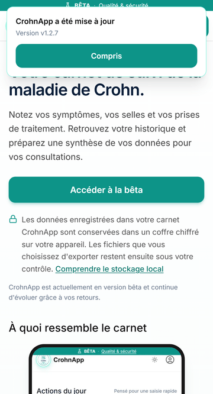

# Mettre à jour CrohnApp sur Android

CrohnApp peut désormais se mettre à jour sans être désinstallée. Chrome peut appliquer une version
silencieusement lorsque l'application est fermée ; dans ce cas, CrohnApp confirme la version active
à la prochaine ouverture.

1. Gardez une connexion Internet active et fermez complètement CrohnApp.
2. Fermez aussi les onglets `crohnapp.com` encore ouverts dans Chrome.
3. Rouvrez CrohnApp. Si « Mise à jour disponible » apparaît, touchez **Rafraîchir**.
4. CrohnApp confirme ensuite la version installée. Elle reste consultable dans **Profil**.

> Ne désinstallez jamais CrohnApp et n'effacez jamais ses données avant d'avoir créé et vérifié une
> sauvegarde. Le coffre médical est stocké uniquement sur l'appareil.

Les installations très anciennes peuvent avoir été créées avant la correction du mécanisme de mise
à jour. Si l'application reste bloquée, créez d'abord les sauvegardes clinique et photos chiffrées,
conservez leurs mots de passe séparément, puis contactez le projet avant toute réinstallation.

## Si deux copies de CrohnApp coexistent sur l'appareil

Une copie de CrohnApp reste rattachée à l'adresse par laquelle elle a été ouverte. Des copies
distinctes apparaissent quand vous utilisez deux adresses différentes, deux navigateurs ou deux
profils de navigateur, ou, selon la plateforme, deux installations isolées. Chacune garde alors son
propre carnet et sa propre version. Dans Chrome ou Chromium, sur un même profil et une même adresse,
l'application installée et l'onglet partagent normalement le même carnet ; certaines plateformes, en
revanche, isolent le stockage de l'application installée.

Signes à repérer : la version affichée dans **Profil** diffère d'une fenêtre à l'autre, des rubriques
manquent dans la navigation, ou des images ne s'affichent pas.

1. Ouvrez toujours CrohnApp depuis `crohnapp.com`. Remplacez les favoris qui pointent ailleurs, par
   exemple vers une adresse commençant par `www.`.
2. Dans la copie restée en arrière, créez les sauvegardes clinique et photos chiffrées, et
   vérifiez-les avant toute autre manipulation.
3. Écrivez à [crohnapp@gmail.com](mailto:crohnapp@gmail.com) avant d'effacer cette copie. Un carnet
   ne se récupère pas une fois la copie supprimée.

> Une même adresse ouverte dans deux navigateurs différents donne également deux carnets distincts.
> C'est le fonctionnement normal d'une application qui ne stocke rien sur un serveur.
